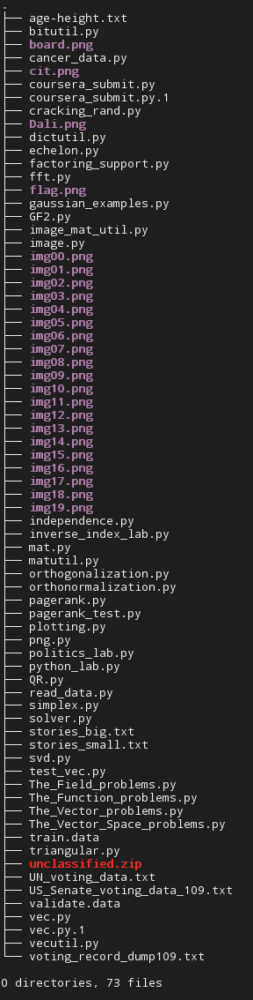
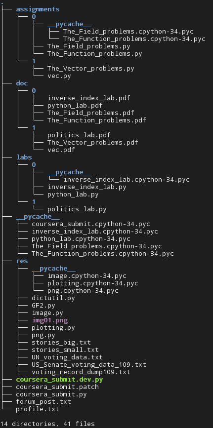

coursera_submit_dirs.py
=========================================

Files
-----------------------------------------
- [coursera_submit_dirs.py](./coursera_submit_dirs.py) - [Coursera](http://coursera.org/) assignment/labs submit script, supporting folders.
- [coursera_submit.patch](./coursera_submit.patch) - Sometimes you fall in love with your code and files, I know that. So in case you don't have the heart to just kill and replace your current coursera_submit.py, here's a patch for it.
- [coursera_submit.py](./coursera_submit.py) - Original submit script

Folder? What? Why?
-----------------------------------------

In the version provided by [Coursera](http://coursera.org/), coursera_submit.py requires **every** (stencil for assignments/labs, resources) file to be in the same directory. Now, in week 3 of my course, I realized: This is gonna end baaaadly.

| Ugh! | That's better :) |
|------|------------------|
|  |  |

Usage
-----------------------------------------

###General
Invoking the script works pretty much the same as before. With the obvious difference, that you can pass it a URI to a file sitting in another directory.
```
python3 ./coursera_submit_dirs.py labs/0/python_lab.py --username Bob --password ...
```
By the way: The directory does **not** have to be a sub-directory of the script.
```
python3 ./coursera_submit_dirs.py /somewhere/else/in/the/matrix/The_Function_problems.py --username Bob --password ...
```

I've also added the [shebang](http://en.wikipedia.org/wiki/Shebang_%28Unix%29), so
```
./corusera_submit_dirs.py stencil.py --userna...
```
works as well, now.

###Resource folders
You can either add a `RES` entry to your profile.txt (see [profile_example.txt](./profile_example.txt)) or use the `--resources` option to define folders for python to look for imports in.
```
./coursera_submit_dirs.py labs/0/python_lab.py --resources "/shared/with/all/res/" "~/coursera/res"
```
***Please note!***<br />
I've designed the `--resources` option to be additive. Meaning, that even if you provide `--resources` explicitly, your `RES` from profile.txt will still be processed. Enabling you to have a standard library (if you will) and still be able to use other imports temporarily, on top of that.

Tales from the ~~cryp~~..., uuuhm, code.
-----------------------------------------

Some documentation of the changes I made.<br />
The code blocks are quite lazily copied from the diff output. Having the script open in an editor aside will certainly help following this.

Also, experienced python programmers will be bored by the following verbosity. I warned you. :p

#####Let's get to it:

####Enable coursera_submit.py to receive a path (/path/to/assignment.py) as 'assign' argument.
-------------------------------------------------------
The way coursera does this is pretty straight forward. The script splits the extension from the passed filename and uses that as the module name for the 'import' statement. Which is the point where the problem arises, since python holds a list of folders to look for imports in (`sys.path`), but it is only populated with 2-3 standard paths and the current scripts path (that's why the imports work, as long as the assign-file is in the same directory).
So the solution here is just as simple:

- Pass only the os.path.basename of the 'assign' argument.
This still works if just a filename is given.
- os.path.dirname of 'assign' on the other hand would be empty then. So check for that and only if 'assign' has a directory part...
- ..., this part is appended to `sys.path`.

*dirPrefix is a global variable*
```python
-    asgn_name = os.path.splitext(args.assign)[0]
+    asgn_name = os.path.splitext(os.path.basename(args.assign))[0]
+    if os.path.dirname(args.assign) != '':
+        dirPrefix = os.path.dirname(args.assign)
+        sys.path.append(os.path.realpath(dirPrefix))
```

Testing...
```bash
== Submitting "(Problem 1) Python Comprehensions: Filtering"
Traceback (most recent call last):
  File "coursera_submit.dev.py", line 433, in <module>
    submit(','.join(args.tasks))
  File "coursera_submit.dev.py", line 265, in submit
    src      = source(source_files)
  File "coursera_submit.dev.py", line 345, in source
    with open(fn) as source_f:
FileNotFoundError: [Errno 2] No such file or directory: 'The_Field_problems.py'
```

Great.
Well, turns out that the server answers to an initial challenge with `asgn_name + '.py'`. It seems the server blindly assumes that all files are in the same directory. The script tries to read the content of `asgn_name + '.py'` in order to send it to the server for grading, which obviously fails with the errors just above.
Adding `dirPrefix` to every received filename
```python
def source(source_files):
...
+        fn = '%s%s%s' % (dirPrefix, os.sep, fn)
```
should do the trick, 'though.
You remember `dirPrefix`, right? Something, global, something? ;)

Testing...
```bash
== Submitting "(Problem 1) Python Comprehensions: Filtering"
Your submission has been accepted and will be graded shortly. 
```
Yay, done! 

####Define resource folders; read those from profile.txt and/or --resources option.
-----------------------------------------------------------------------------------------------------------------

The imports worked now, but as I happily had my trees back, I ran into the problem of having all those resource files, which are partially (e.g. plot.py) used across weeks/assignments/labs. Oh well... Copy them over... Ugh! There's another thing I don't like, just as crowded folders: Redundancy where not needed. I know, this is something I picked up in times where we had only 512KB RAM and 20MB HDDs, but still.
Luckily, they are more or less static and the only necessity would be, that python has them in its scope; so - once again - `sys.path` to the rescue!

First off:

***profile_RES_to_list: function; returns list of ['/path/','/values', '/from/profile.txt/'] or []***

- profile.txt is simply parsed as 'Key Value' pairs, both Key and Value as strings.
==Saved paths therefore should have the format `RES "path1", "path2", "path3"` for this function to return corret results.==
```python
+def profile_RES_to_list():
+    return [ s.replace('"','') for s in profile.get('RES', '').split(',') if s != '' ]
```

***parse_res_paths: function; takes a list of paths (strings); returns list of valid paths (strings)***

- If `res_paths` differs from RES in profile.txt, assume --resources had been used and add RES.
- Loop through `res_paths` and append to `valid_paths` if isdir(p) is true.
- Prompt user whether he wants to continue, if at least one path is invalid (i.e. no directory present on you system).
```python
+def parse_res_paths(res_paths):
+    valid_paths = []
+    if res_paths != profile_RES_to_list():
+        res_paths.extend(profile_RES_to_list())
+    for p in res_paths:
+        print('Validating \'' + p + '\' ... ', end='')
+        if os.path.isdir(p):
+            print('OK')
+            valid_paths.append(p)
+        else:
+            print('FAIL!')
+
+    if len(valid_paths) != len(res_paths):
+        print('You have at least one invalid path in your --resources list.')
+        cont = input('This may result in broken imports. Continue? [Y/n]: ')
+        if cont.lower() == 'n':
+            exit(1)
+    return valid_paths
```
This `parse_res_paths` is called in `if __name__ == '__main__':`
```python
if args.resources != []:
        print('Found resource path(s):')
        sys.path.extend(parse_res_paths(args.resources))
```
with either the arguments of the --resources option or RES in profile.txt or an empty list:
```python
+    parser.add_argument('--resources', default=profile_RES_to_list(), nargs='+', help=next(ihelp))
```
-----------------------------------------------------------------------------------------------------------------
Sure hope I didn't overlook anything. For me, it works. Let me know if it does for you, too.
And especially if not! I will try reproduce and solve any issues.
I'm not exactly sure on how Windows handles all of this, since I haven't had the chance to test it there, yet.

<hr />
So long, and never forget:<br />
'Cause serious coding is supposed to be fun! :)<br />
http://www.workofprogress.org

-r.beer
